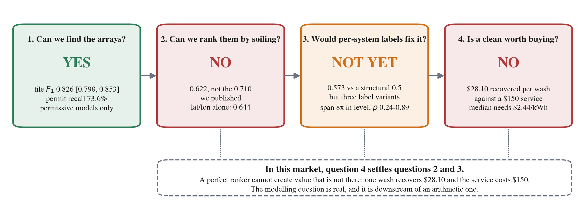

# Solar Soiling Detection

Finding rooftop solar arrays in public aerial imagery, estimating how much dirt (soiling) each one
loses, and working out whether paying to clean them is worth it. Everything runs on public data.

**Author:** Cameron Gordon

## Paper (working draft)

**Station Labels Cannot Rank Roofs: Why Public-Data Soiling Models Do Not Transfer, and What
Cleaning Is Actually Worth.** [PDF, 18 pages](paper/paper.pdf)

This is a working draft. It hasn't been peer reviewed or submitted yet.

Finding rooftop arrays in public aerial imagery works well (tile-level F1 0.826, 95% CI [0.798,
0.853]). Ranking those arrays by how dirty they get does not, because the public soiling labels are
measured at weather stations, not on roofs: once validation holds out both the site and the year,
AUC drops from 0.710 to 0.622 (95% CI [0.571, 0.670]), which is below my 0.70 gate and below what
latitude and longitude get on their own (0.644). And a better ranking wouldn't change the answer:
on 149 metered rooftops, one wash recovers a median $28.10 of electricity against a $150 service
call.



*Figure 1. The whole argument in one picture. Question 4 is simple arithmetic, and in this market
it settles questions 2 and 3: a perfect ranking can't create value that isn't there.*

**Companion paper:** *Permissively Licensed Rooftop Array Detection at 21 cm, with an Executable
Gate, and Per-Array Roof Geometry from Public Lidar.* [PDF, 7 pages](paper/paper_detection.pdf).
Also a working draft. It covers the detection and roof-geometry stages in full: the gate, the
building-permit recall check, the SAM2 prompt-box result and the lidar tilt method.

## What I found

The goal was a pipeline that could flag which rooftop arrays in a county are worth cleaning,
using only public data. It has three stages: detect the arrays, predict each one's soiling, and
turn that into a dollar decision. What came out of it:

1. **Detection works.** RF-DETR with a SAM2 mask stage, on Santa Cruz County's 21 cm aerial
   imagery, gets a tile-level box F1 of 0.826 on the held-out test set (precision 0.850, recall
   0.803). As an independent check, it finds 73.6% of the arrays in county building permits it
   never saw.

2. **Ranking roofs by soiling doesn't work, and my own validation hid that for a while.** The two
   folds I originally used each held out one thing but not the other. The spatial fold held out
   *place* but kept a station's other years in training, and leave-one-year-out held out the
   *year* but kept the same station. That was true for 88.7% of rows, so neither fold ever scored
   a station the model hadn't seen. With a fold that holds out both:

   | | AUC |
   |---|---|
   | XGBoost, 40 features | 0.622 (95% CI [0.571, 0.670]) |
   | latitude + longitude only | 0.644 |
   | Kimber (2006) physics model, no training | 0.610 |
   | what the leaking fold reported | 0.710 |

   A size-matched control shows 83% of that drop (95% CI [52, 99]) is from the leak rather than
   from having less training data. The older numbers weren't mismeasured; every one reproduces to
   within 0.012. The problem was how the folds were built. Out of region it's worse: 0.655 pooled
   and 0.527 on the largest region.

   The deeper problem is the label. Public soiling labels are measured at stations, so every roof
   near a station gets the same number. Per-system telemetry does carry real per-roof signal (0.573
   against the 0.5 a station label can't beat), but the three standard ways of estimating a
   system's soiling disagree with each other (median loss 2.72%, 9.80% or 20.93% on the same
   systems, rank correlation 0.24 to 0.89). Better labels are needed, but they aren't enough on
   their own yet.

3. **Cleaning doesn't pay here.** On 149 metered California rooftops, with 505 observed cleaning
   events, one wash recovers a median $28.10 of electricity, against a $150 service charge (my assumed
   price, not a market quote). The median roof would need electricity at $2.44/kWh to break even, about five times
   California retail. That dollar figure is the same under all three soiling estimates, because
   the annual loss cancels out of the calculation. Across the 1,865 sites detected in Santa Cruz,
   none come out ahead on a cleaning, at least for the soiling that rain and washing can remove.

So the useful product is a diagnosis ("here's what your array loses, and no, don't pay to clean
it"), not a list of cleaning leads. I think the parts that carry over to other problems are the
fold design, the label-unit diagnosis and the arithmetic.

## Results

| Stage | Metric | Value |
|---|---|---|
| Detection | tile-level box F1 @ IoU 0.50 (test, confidence tuned on val) | 0.826, 95% CI [0.798, 0.853] |
| Detection | precision / recall | 0.850 / 0.803 |
| Detection | recall against unseen building permits | 73.6% |
| Detection | SAM2 mask area vs ground truth | median ratio 1.01, 0% roof-grab |
| Soiling | AUC, site and year held out together | 0.622, 95% CI [0.571, 0.670] (gate 0.70, not met) |
| Soiling | AUC, whole region held out | 0.655 pooled, 0.527 largest region |
| Soiling | out-of-year calibration | Brier 0.218 vs 0.250 base rate |
| Economics | value of one wash, median of 149 metered systems | $28.10 at retail, $10.14 at the net-billing blended rate |
| Economics | break-even electricity price, median system | $2.44/kWh |

Every headline number, the file it comes from and how to reproduce it is in
[`docs/CANONICAL_NUMBERS.md`](docs/CANONICAL_NUMBERS.md). If another doc disagrees with it, that
doc is out of date.

## How it works

```
county aerial imagery (21 cm)
  -> 640 px tiles, CRS and affine transform kept for every tile
  -> RF-DETR detector (Apache-2.0), whole tile as a 2x2 chip grid, NMS across the seams
  -> SAM2 masks from a prompt box shrunk 15%
  -> georeferenced array polygons, plus roof tilt and azimuth from USGS 3DEP lidar
  -> features: weather (ERA5), air quality (CAMS), land cover (ESA WorldCover), OSM proximity
  -> XGBoost soiling model with isotonic calibration
  -> cleaning decision: sourced electricity rates, Monte Carlo over the uncertain inputs
```

A few choices worth explaining:

- **The detection gate is a script, not a sentence.** `scripts/detect/eval_tile_f1.py` defines it:
  F1 on boxes through the real production path, confidence tuned on val and frozen before test is
  touched, and a 95% CI from bootstrapping over tiles instead of objects (arrays in the same tile
  are correlated, so resampling objects gives an interval that's too narrow).
- **Compare two models with a paired test.** Two detector versions had overlapping confidence
  intervals, which looks like noise. But they were scored on the same 49 tiles, so the right test
  is a bootstrap on the per-tile difference: +0.025 F1, 95% CI [+0.005, +0.044]. The gain was real.
- **Fix the prompt box, not the mask.** Area feeds straight into the dollar calculation, so a mask
  that spills onto the roof is a pricing error. Shrinking SAM2's prompt box by 15% took median IoU
  from 0.509 to 0.844 and roof-grab from 43% to 0%. I tried two fancier fixes (negative points and
  mask containment) and both did worse; they're still behind flags so the results can be
  reproduced.
- **Report dollars, not a recovery fraction.** The whole cleaning case used to rest on an assumed
  recovery fraction of 0.90. A simulation puts it at 0.045, and on real systems it has no single
  value (0.031 to 0.217 depending on the soiling estimate). The dollars recovered per wash don't
  depend on that choice, so that's what I report. Every constant in the dollar calculation is
  either sourced or marked `UNSOURCED` in the code. The audit is in
  [`docs/ECONOMICS_GROUNDING_20260809.md`](docs/ECONOMICS_GROUNDING_20260809.md).
- **Keep the licence clean.** The detector is RF-DETR and SAM2, both Apache-2.0. The older YOLO /
  SAHI path is AGPL-3.0, so it's in an optional `legacy` extra that isn't installed by default.

## Repository layout

```
src/solarsoiled/   CLI, API, model registry, run manifests
src/risk/          soiling features, risk model, recovery and electricity-rate math
src/utils/         detection matching, error analysis, tile metadata
scripts/           pipeline scripts by stage: data, detect, analyze, predict, labeling
paper/             both papers: LaTeX source, figure scripts and built PDFs
configs/           model and experiment configs (hyperparameters live here, not in scripts)
models/            model registry (weights aren't in git)
docs/              working notes, method write-ups and audits
tests/             test suite
```

## Running it

The code and tests are all here, but the data isn't. Model weights, imagery, label sets and the
paper's audit outputs live in a private repository, so anything that needs them (training, the
detection gate, regenerating the paper's numbers) won't run from this repo. Some docs refer to a
`gh release download` step; that won't work from here either. [`DATA.md`](DATA.md) lists what the
data is.

Setup and tests, which need no data:

```bash
bash setup/setup_conda.sh
conda activate solar-soiling
pip install -e .          # installs the solarsoiled CLI
make test-fast
```

With the data in place, the full pipeline on an area of interest:

```bash
solarsoiled run \
  --aoi "minx,miny,maxx,maxy" \
  --weights production \
  --soiling-model runs/soiling/run_latest/model.ubj \
  --last-cleaned 2026-01-01 \
  --partner-id smoketest
```

There's also a Docker build (`make docker-build`, then `make docker-smoke` to check the detector
actually imports inside the image).

The cleaning decision is also deployed as a small API. It doesn't need any model weights, since
it's just arithmetic over sourced constants:

```bash
curl -s "https://solarsoiled-api.onrender.com/decision?system_kw=6&install_date=2015-06-01"
```

It's on a free tier, so the first request can take about 30 seconds to wake up. Each response says
where every input came from and what would have to be true for cleaning to pay.

## Building the paper

```bash
cd paper
make        # figures -> number check -> build/paper.pdf (needs tectonic)
```

`make` won't work from this repo, because the figures and `verify_numbers.py` (which fails the
build if any number in the paper doesn't match its source file) read the audit outputs that aren't
included. The checked-in [`paper.pdf`](paper/paper.pdf) and
[`paper_detection.pdf`](paper/paper_detection.pdf) are built from this source.
The companion paper, [`paper_detection.pdf`](paper/paper_detection.pdf) (7 pages, also a working
draft), covers the detection gate, the permit recall check, the SAM2 prompt-box result and the
lidar roof geometry in full. [`paper/README.md`](paper/README.md) explains which paper is which.

## About this repo

This is a public snapshot of my working repository, with a few files held back (outreach records
that name real homes, plus local tool configuration). [`MIRROR.md`](MIRROR.md) lists them and why.
The `docs/` folder is the project's working notes, written as things happened, so older ones can be
out of date. When in doubt, go by the paper and `docs/CANONICAL_NUMBERS.md`.

## License

Apache-2.0. See [`LICENSE`](LICENSE).
